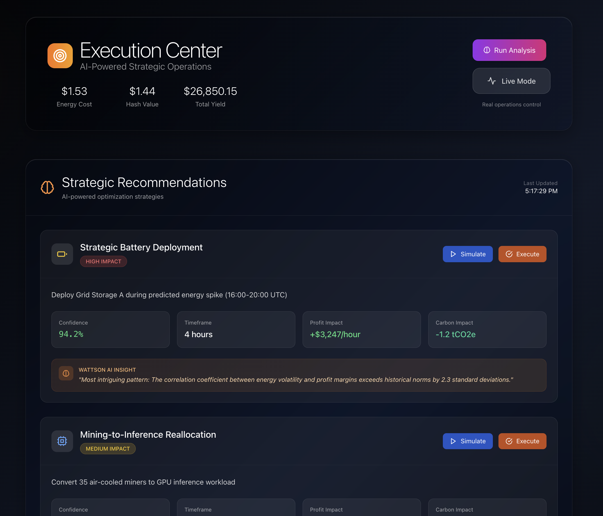
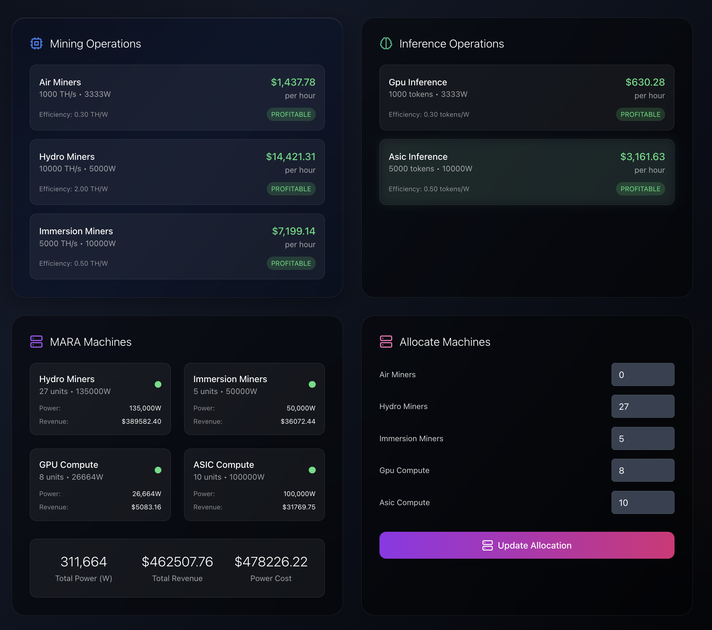

# WattsonAI - MARA Operations AI

**Professional Black-themed enterprise AI agent for optimizing mining operations**

WattsonAI is an intelligent AI assistant that helps MARA optimize their mining operations by extracting insights from energy prices and hash prices, providing real-time analysis and automated recommendations.

## Overview

WattsonAI is designed to streamline operations in a compute/data center environment, leveraging the MARA Hackathon API and integrating Claude AI for enhanced system configuration and allocation.

## Table of Contents

- [Demo Video](#demo-video)
- [Key Features](#key-features)
- [Screenshots](#screenshots)
- [Technical Architecture](#technical-architecture)
- [Repository Structure](#repository-structure)
- [Getting Started](#getting-started)
- [Project Description](#project-description)
- [License](#license)

## Demo Video

[](https://www.youtube.com/watch?v=XDzWh5-onb0&feature=youtu.be)

*Click the thumbnail above to watch our comprehensive demo showcasing WattsonAI's intelligent mining operations optimization, real-time analytics, and AI-powered decision making capabilities.*

## Key Features

- **AI Status Summary**: Real-time system status with green/yellow/red indicators
- **Smart Notifications**: AI-powered alerts for market changes and operational events
- **Market Overview**: Live energy, hash, and token pricing
- **Wattson Insights**: AI-generated observations with confidence metrics
- **Voice Input**: Speech recognition for hands-free operation
- **Natural Language Processing**: Query operations data in plain English

## Screenshots

- **Homepage**  
  The homepage provides a high-level overview including AI status indicators, live energy and hash price metrics, profitability summaries, and recent AI-generated notifications.  
  

- **Command Center**  
  The Command Center offers an interactive interface for voice-activated commands, fleet management controls, and real-time status updates with quick action buttons.  
  

- **Execution Center**  
  The Execution Center displays AI-driven recommendations, simulation mode toggles, and performance metrics with confidence scoring for strategy testing.  
  

- **Operations Analytics**  
  The Operations Analytics dashboard presents detailed charts and tables for energy prices, hash rates, profit per watt, and carbon efficiency trends over time.  
  

- **AI Analyst Example**  
  The AI Analyst panel demonstrates the Wattson AI chat widget, supporting natural language queries and voice input for in-depth operational insights.  
  

- **Configure your machines at your site**  
  This page allows you to allocate hardware resources, manage site capacities, and adjust performance thresholds for your mining and inference fleet.  
  

- **Configuration**  
  The Configuration panel lets you set API keys, site parameters, alert thresholds, and user preferences for the WattsonAI system.  
  

- **Emergency Center**  
  The Emergency Center provides critical controls to pause operations, trigger alerts, and monitor system health during urgent situations.  
  

- **Wattson Example**  
  An example visualization showcasing the liquid glass effect and advanced UI components that enhance user experience in WattsonAI.  
  

## Technical Architecture

WattsonAI combines several technologies to create a seamless, user-friendly experience:

- **Frontend**: React 18 with modern hooks
- **Styling**: Tailwind CSS with custom dark theme
- **Charts**: Recharts for data visualization
- **API Integration**: Axios for MARA Hackathon API
- **Voice**: Web Speech API for voice commands

## Repository Structure

```
WattsonAI/
├── README.md                # Project overview and setup instructions
├── INTEGRATION.md           # API integration guide
├── package.json             # Front-end dependencies & scripts
├── package-lock.json        # Front-end lockfile
├── render.yaml              # Deployment configuration
├── public/                  # Static assets and screenshots
│   ├── index.html
│   ├── manifest.json
│   └── screenshots/         # Screenshot images used in README
├── src/                     # React front-end source code
│   ├── App.js
│   ├── App.css
│   ├── index.js
│   ├── index.css
│   ├── components/          # UI components (ChatWidget, CommandCenter, etc.)
│   ├── context/             # React context providers (DataContext)
│   ├── services/            # API wrappers and mock data (api.js, mockData.js)
│   └── utils/               # Utilities and AI integration (wattsonAI.js)
└── backend/                 # Express server and API proxy
    ├── package.json         # Backend dependencies & scripts
    ├── package-lock.json    # Backend lockfile
    ├── server.js            # Express app entrypoint
    └── test.js              # Basic backend tests
```

## Getting Started

### Prerequisites

- Node.js v14+ and npm

### Configure Environment Variables

In the `backend/` directory, create a `.env` file with your Anthropics API key:

```bash
ANTHROPIC_API_KEY=your_anthropic_api_key_here
```

### Backend Setup

```bash
cd backend
npm install
npm run dev   # or `npm start` to run without auto-reload
```

The backend will start on port `3001` by default.

### Front-end Setup

In a separate terminal:

```bash
cd WattsonAI
npm install
npm start
```

The front-end will start on port `3000` and proxy API requests to the backend.

## Project Description

WattsonAI is a voice-enabled, AI-driven tool for optimizing mining operations, providing real-time insights and recommendations.

## License

This project is licensed under the MIT License.